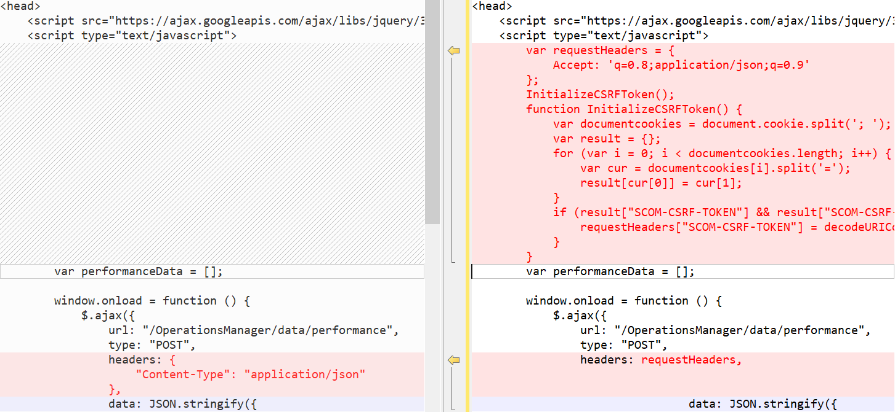

# System Center Operations Manager REST API Reference

Welcome to the System Center Operations Manager REST API Reference.

This reference of the Representational State Transfer (REST) API is applicable to System Center Operations Manager 1801 and later versions. The program supports a set of HTTP operations (methods) to create, retrieve, update, or delete access to the operational data by using the Custom dashboard widget in the new System Center Operations Manager 1801 Web console.

The new HTML5-based dashboards includes support for a Custom widget that executes the HTML code that uses methods that are available in this REST API to visualize the desired output in a variety of visualizations. For more information about the Operations Manager HTLM5 dashboards, see [Overview of HTML5 Web console and dashboards](https://docs.microsoft.com/system-center/scom/manage-overview-html5-webconsole). For more information about how to work with the Custom widget, see [How create a dashboard with the Custom widget in the Web console](https://docs.microsoft.com/system-center/scom/manage-create-web-dashboard-custom).

> [!NOTE]
> Quick Start Guide:
> [SCOM: Quick Start - REST API - TechNet Articles - TechNet Wiki (microsoft.com)](https://social.technet.microsoft.com/wiki/contents/articles/53978.scom-quick-start-rest-api.aspx)

> [!NOTE]
> Operations Manager 2019 UR1 supports Cross-Site Request Forgery (CSRF) tokens to prevent CSRF attacks. If you are using Operations Manager 2019 UR1, you must initialize the CSRF token. HTML scripts do not work if the CSRF tokens are not initialized.

## Initialize the CSRF token

Required action, applicable for Operations Manager 2019 UR1.

1. In the HTML header of the dashboard, add the following code:

```var requestHeaders = {
            Accept: 'q=0.8;application/json;q=0.9',
            "Content-Type": "application/json"
        };
        InitializeCSRFToken();
        function InitializeCSRFToken() {
            var documentcookies = document.cookie.split('; ');
            var result = {};
            for (var i = 0; i < documentcookies.length; i++) {
                var cur = documentcookies[i].split('=');
                result[cur[0]] = cur[1];
            }
            if (result["SCOM-CSRF-TOKEN"] && result["SCOM-CSRF-TOKEN"] != null) {
                requestHeaders["SCOM-CSRF-TOKEN"] = decodeURIComponent(result["SCOM-CSRF-TOKEN"]);
            }
        }
```

1. In the **onload** function, change the header value to **requestHeaders**. If the header value does not exist, add it as shown below:

**Example:**



## Examples

The following examples demonstrate how to make calls to the Operations Manager REST API with the Custom widget.  

### Bar chart

The following HTML code demonstrates rendering a bar chart with alert data.

```<!DOCTYPE HTML>
<html>

<head>
    <script src="https://ajax.googleapis.com/ajax/libs/jquery/3.2.1/jquery.min.js"></script>
    <script type="text/javascript">
        var criticalCounter = 0;
        var informationCounter = 0;
        var warningCounter = 0;

        window.onload = function () {
            $.ajax({
                url: "/OperationsManager/data/alert",
                type: "POST",
                data: JSON.stringify ({
                    "classId": null,
                    "objectIds": { "3c8ac4f3-475e-44dd-4163-8a97af363705": -1 },
                    "criteria": "((Severity = '0') OR (Severity = '1') OR (Severity = '2') OR (Severity = '3')) AND ((Priority = '2') OR (Priority = '1') OR (Priority = '0')) AND ((ResolutionState = '0') OR (ResolutionState = '247') OR (ResolutionState = '248') OR (ResolutionState = '249') OR (ResolutionState = '250') OR (ResolutionState = '254') OR (ResolutionState = '255'))",
                    "displayColumns":
                    [
                        "severity","monitoringobjectdisplayname","name","age","repeatcount","lastModified"
                    ]
                }),
                success: function (result) {
                    for (var i = 0; i < result.rows.length; i++) {
            switch(result.rows[i].severity)
            {
                case "Error":
                    criticalCounter++;
                    break;
                case "Information":
                    informationCounter++;
                    break;
                case "Warning":
                                    warningCounter++
                    break;
            }
                    }
                    renderChart();
                }
            });
        }

        function renderChart() {
            var chart = new CanvasJS.Chart("chartContainer", {
                title: {
                    text: "Alerts representation in bar chart"
                },
                data: [{
                    type: "column",
                    dataPoints: [
                        { y: criticalCounter, label: "Critical" },
                        { y: warningCounter, label: "Warning" },
                        { y: informationCounter, label: "Information" }
                    ]
                }]
            });
            chart.render();
        }
    </script>
    <script src="https://cdnjs.cloudflare.com/ajax/libs/canvasjs/1.7.0/canvasjs.min.js"></script>
    <title>CanvasJS Example</title>
</head>

<body>
    <div id="chartContainer" style="height: 400px; width: 100%;"></div>
</body>

</html>
```

### Pie chart

The following HTML code demonstrates rendering a pie chart with alert data.

```<!DOCTYPE HTML>
<html>

<head>
    <script src="https://ajax.googleapis.com/ajax/libs/jquery/3.2.1/jquery.min.js"></script>
    <script type="text/javascript">
        var criticalCounter = 0;
        var informationCounter = 0;
        var warningCounter = 0;

        window.onload = function () {
            $.ajax({
                url: "/OperationsManager/data/alert",
                type: "POST",
                data: JSON.stringify ({
                    "classId": null,
                    "objectIds": { "3c8ac4f3-475e-44dd-4163-8a97af363705": -1 },
                    "criteria": "((Severity = '0') OR (Severity = '1') OR (Severity = '2') OR (Severity = '3')) AND ((Priority = '2') OR (Priority = '1') OR (Priority = '0')) AND ((ResolutionState = '0') OR (ResolutionState = '247') OR (ResolutionState = '248') OR (ResolutionState = '249') OR (ResolutionState = '250') OR (ResolutionState = '254') OR (ResolutionState = '255'))",
                    "displayColumns":
                    [
                        "severity","monitoringobjectdisplayname","name","age","repeatcount","lastModified"
                    ]
                }),
                success: function (result) {
                    for (var i = 0; i < result.rows.length; i++) {
            switch(result.rows[i].severity)
            {
                case "Error":
                    criticalCounter++;
                    break;
                case "Information":
                    informationCounter++;
                    break;
                case "Warning":
                                    warningCounter++
                    break;
            }
                    }
                    renderChart();
                }
            });
        }

        function renderChart() {
            var chart = new CanvasJS.Chart("chartContainer",
                {
                    theme: "theme2",
                    title: {
                        text: "Alerts representation in Pie chart"
                    },
                    data: [
                        {
                            type: "pie",
                            showInLegend: true,
                            toolTipContent: "{y} - #percent %",
                            legendText: "{indexLabel}",
                            dataPoints: [
                                { y: criticalCounter, indexLabel: "Critical" },
                                { y: warningCounter, indexLabel: "Warning" },
                                { y: informationCounter, indexLabel: "Information" }
                            ]
                        }
                    ]
                });
            chart.render();
        }
    </script>
    <script src="https://cdnjs.cloudflare.com/ajax/libs/canvasjs/1.7.0/canvasjs.min.js"></script>
    <title>CanvasJS Example</title>
</head>

<body>
    <div id="chartContainer" style="height: 400px; width: 100%;"></div>
</body>

</html>
```

### 3D Pie chart

The following HTML code demonstrates rendering a 3D pie chart with alert data.

```<!DOCTYPE HTML>
<html>

<head>
    <script src="https://ajax.googleapis.com/ajax/libs/jquery/3.2.1/jquery.min.js"></script>
    <script type="text/javascript">
        var criticalCounter = 0;
        var informationCounter = 0;
        var warningCounter = 0;

        window.onload = function () {
            $.ajax({
                url: "/OperationsManager/data/alert",
                type: "POST",
                data: JSON.stringify ({
                    "classId": null,
                    "objectIds": { "3c8ac4f3-475e-44dd-4163-8a97af363705": -1 },
                    "criteria": "((Severity = '0') OR (Severity = '1') OR (Severity = '2') OR (Severity = '3')) AND ((Priority = '2') OR (Priority = '1') OR (Priority = '0')) AND ((ResolutionState = '0') OR (ResolutionState = '247') OR (ResolutionState = '248') OR (ResolutionState = '249') OR (ResolutionState = '250') OR (ResolutionState = '254') OR (ResolutionState = '255'))",
                    "displayColumns":
                    [
                        "severity","monitoringobjectdisplayname","name","age","repeatcount","lastModified"
                    ]
                }),
                success: function (result) {
                    for (var i = 0; i < result.rows.length; i++) {
            switch(result.rows[i].severity)
            {
                case "Error":
                    criticalCounter++;
                    break;
                case "Information":
                    informationCounter++;
                    break;
                case "Warning":
                                    warningCounter++
                    break;
            }
                    }
                    renderChart();
                }
            });
        }

        function renderChart() {
            var chart = new Highcharts.chart('container', {
    chart: {
        type: 'pie',
        options3d: {
            enabled: true,
            alpha: 45,
            beta: 0
        }
    },
    title: {
        text: 'Alerts share per severity'
    },
    tooltip: {
        pointFormat: '{series.name}: <b>{point.percentage:.1f}%</b>'
    },
    plotOptions: {
        pie: {
            allowPointSelect: true,
            cursor: 'pointer',
            depth: 35,
            dataLabels: {
                enabled: true,
                format: '{point.name}'
            }
        }
    },
    series: [{
        type: 'pie',
        name: 'Alerts share',
        data: [
            {
                name: 'Critical',
                y: 48,
                sliced: true,
                selected: true
            },
            ['Warning', 39],
            ['Information', 13],
        ]
    }]
});

            chart.render();
        }
    </script>
   <script src="https://code.highcharts.com/highcharts.js"></script>
<script src="https://code.highcharts.com/highcharts-3d.js"></script>
<script src="https://code.highcharts.com/modules/exporting.js"></script>

<div id="container" style="height: 400px"></div>
</head>

<body>
    <div id="chartContainer" style="height: 400px; width: 100%;"></div>
</body>

</html>
```

### Donut chart

The following HTML code demonstrates rendering a donut chart with alert data.

```<!DOCTYPE HTML>
<html>

<head>
    <script src="https://ajax.googleapis.com/ajax/libs/jquery/3.2.1/jquery.min.js"></script>
    <script type="text/javascript">
        var criticalCounter = 0;
        var informationCounter = 0;
        var warningCounter = 0;

        window.onload = function () {
            $.ajax({
                url: "/OperationsManager/data/alert",
                type: "POST",
                data: JSON.stringify ({
                    "classId": null,
                    "objectIds": { "3c8ac4f3-475e-44dd-4163-8a97af363705": -1 },
                    "criteria": "((Severity = '0') OR (Severity = '1') OR (Severity = '2') OR (Severity = '3')) AND ((Priority = '2') OR (Priority = '1') OR (Priority = '0')) AND ((ResolutionState = '0') OR (ResolutionState = '247') OR (ResolutionState = '248') OR (ResolutionState = '249') OR (ResolutionState = '250') OR (ResolutionState = '254') OR (ResolutionState = '255'))",
                    "displayColumns":
                    [
                        "severity","monitoringobjectdisplayname","name","age","repeatcount","lastModified"
                    ]
                }),
                success: function (result) {
                    for (var i = 0; i < result.rows.length; i++) {
            switch(result.rows[i].severity)
            {
                case "Error":
                    criticalCounter++;
                    break;
                case "Information":
                    informationCounter++;
                    break;
                case "Warning":
                                    warningCounter++
                    break;
            }
                    }
                    renderChart();
                }
            });
        }

        function renderChart() {
            var chart = new CanvasJS.Chart("chartContainer",
                {
                    theme: "theme2",
animationEnabled: true,
                    title: {
                        text: "Alerts representation in doughnut"
                    },
                    data: [
                        {
                            type: "doughnut",
                indexLabelFontFamily: "Garamond",
                indexLabelFontSize: 20,
                startAngle:0,
                indexLabelFontColor: "dimgrey",
                indexLabelLineColor: "darkgrey",
                toolTipContent: "{y} %",
                            dataPoints: [
                                { y: criticalCounter, indexLabel: "Critical" },
                                { y: warningCounter, indexLabel: "Warning" },
                                { y: informationCounter, indexLabel: "Information" }
                            ]
                        }
                    ]
                });
            chart.render();
        }
    </script>
    <script src="https://cdnjs.cloudflare.com/ajax/libs/canvasjs/1.7.0/canvasjs.min.js"></script>
    <title>CanvasJS Example</title>
</head>

<body>
    <div id="chartContainer" style="height: 400px; width: 100%;"></div>
</body>

</html>
```

### 3D Donut chart

The following HTML code demonstrates rendering a 3D donut chart with alert data.

```<!DOCTYPE HTML>
<html>

<head>
    <script src="https://ajax.googleapis.com/ajax/libs/jquery/3.2.1/jquery.min.js"></script>
    <script type="text/javascript">
        var criticalCounter = 0;
        var informationCounter = 0;
        var warningCounter = 0;

        window.onload = function () {
            $.ajax({
                url: "/OperationsManager/data/alert",
                type: "POST",
                data: JSON.stringify ({
                    "classId": null,
                    "objectIds": { "3c8ac4f3-475e-44dd-4163-8a97af363705": -1 },
                    "criteria": "((Severity = '0') OR (Severity = '1') OR (Severity = '2') OR (Severity = '3')) AND ((Priority = '2') OR (Priority = '1') OR (Priority = '0')) AND ((ResolutionState = '0') OR (ResolutionState = '247') OR (ResolutionState = '248') OR (ResolutionState = '249') OR (ResolutionState = '250') OR (ResolutionState = '254') OR (ResolutionState = '255'))",
                    "displayColumns":
                    [
                        "severity","monitoringobjectdisplayname","name","age","repeatcount","lastModified"
                    ]
                }),
                success: function (result) {
                    for (var i = 0; i < result.rows.length; i++) {
            switch(result.rows[i].severity)
            {
                case "Error":
                    criticalCounter++;
                    break;
                case "Information":
                    informationCounter++;
                    break;
                case "Warning":
                                    warningCounter++
                    break;
            }
                    }
                    renderChart();
                }
            });
        }

        function renderChart() {
            var chart = Highcharts.chart('container', {
    chart: {
        type: 'pie',
        options3d: {
            enabled: true,
            alpha: 45
        }
    },
    title: {
        text: 'Alerts representation in 3D donut'
    },
    subtitle: {
        text: ''
    },
    plotOptions: {
        pie: {
            innerSize: 100,
            depth: 45
        }
    },
    series: [{
        name: 'Number of alerts',
        data: [
        ['Critical', criticalCounter],
                                ['Warning', warningCounter ],
                                ['Information',  informationCounter]

        ]
    }]
});
            chart.render();
        }
    </script>
    <script src="https://code.highcharts.com/highcharts.js"></script>
<script src="https://code.highcharts.com/highcharts-3d.js"></script>
<script src="https://code.highcharts.com/modules/exporting.js"></script>

<div id="container" style="height: 400px">
</div>
</head>

<body>
    <div id="chartContainer" style="height: 400px; width: 100%;"></div>
</body>

</html>
```

### Combination chart

The following HTML code demonstrates creating a Combination chart to display alerts in a pie and spline chart.

```<!DOCTYPE HTML>
<html>

<head>
    <script src="https://ajax.googleapis.com/ajax/libs/jquery/3.2.1/jquery.min.js"></script>
    <script type="text/javascript">
        var criticalCounter = 0;
        var informationCounter = 0;
        var warningCounter = 0;
var totalCounter =0;

        window.onload = function () {
            $.ajax({
                url: "/OperationsManager/data/alert",
                type: "POST",
                data: JSON.stringify ({
                    "classId": null,
                    "objectIds": { "3c8ac4f3-475e-44dd-4163-8a97af363705": -1 },
                    "criteria": "((Severity = '0') OR (Severity = '1') OR (Severity = '2') OR (Severity = '3')) AND ((Priority = '2') OR (Priority = '1') OR (Priority = '0')) AND ((ResolutionState = '0') OR (ResolutionState = '247') OR (ResolutionState = '248') OR (ResolutionState = '249') OR (ResolutionState = '250') OR (ResolutionState = '254') OR (ResolutionState = '255'))",
                    "displayColumns":
                    [
                        "severity","monitoringobjectdisplayname","name","age","repeatcount","lastModified"
                    ]
                }),
                success: function (result) {
                    for (var i = 0; i < result.rows.length; i++) {
            switch(result.rows[i].severity)
            {
                case "Error":
                    criticalCounter++;
                    break;
                case "Information":
                    informationCounter++;
                    break;
                case "Warning":
                                    warningCounter++
                    break;
            }
                    }
                    renderChart();
                }
            });
        }

        function renderChart() {
            var chart = new Highcharts.chart('container', {
    title: {
        text: 'Alerts representation in combination chart'
    },
    xAxis: {
        categories: ['Critical', 'Warning', 'Information']
    },
    labels: {
        items: [{
            html: 'Total alerts generated',
            style: {
                left: '50px',
                top: '0px',
                color: (Highcharts.theme && Highcharts.theme.textColor) || 'black'
            }
        }]
    },
    series: [{
        type: 'column',
        name: 'Critical',
        data: [criticalCounter, 0, 0]
    }, {
        type: 'column',
        name: 'Warning',
        data: [0, warningCounter, 0]
    }, {
        type: 'column',
        name: 'Information',
        data: [0, 0, informationCounter]
    }, {
        type: 'spline',
        name: 'Spline chart',
        data: [criticalCounter, warningCounter, informationCounter],
        marker: {
            lineWidth: 2,
            lineColor: Highcharts.getOptions().colors[3],
            fillColor: 'white'
        }
    }, {
        type: 'pie',
        name: 'Total consumption',
        data: [{
            name: 'Critical',
            y: criticalCounter,
            color: Highcharts.getOptions().colors[0] // Jane's color
        }, {
            name: 'Warning',
            y: warningCounter,
            color: Highcharts.getOptions().colors[1] // John's color
        }, {
            name: 'Information',
            y: informationCounter,
            color: Highcharts.getOptions().colors[2] // Joe's color
        }],
        center: [150, 100],
        size: 100,
        showInLegend: false,
        dataLabels: {
            enabled: false
        }
    }]
});


            chart.render();
        }
    </script>
    <script src="https://code.highcharts.com/highcharts.js"></script>
<script src="https://code.highcharts.com/modules/exporting.js"></script>

<div id="container" style="min-width: 310px; height: 400px; margin: 0 auto"></div>

</head>

<body>
    <div id="chartContainer" style="height: 400px; width: 100%;"></div>
</body>

</html>
```
